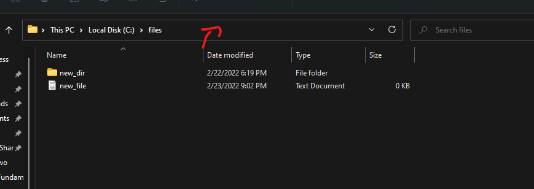
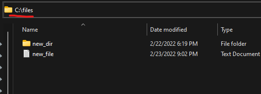

# Homework note 1:

As you have seen, **open()** works with files that are in the same folder as the .py file.

When you want to read files using **open()** you should either provide the name of the file: example _my_file.txt_ (for
a file that is in the same folder as the .py file you are executing)

```python
file = open('my_file.txt')
```

Or you can provide the full path to file: example _'C:\\files\\new_file.txt'_ Use backslash \ to escape the backlash in
the file path.

````python
file = open('C:\\files\\new_file.txt')  # Change your path accordingly
````

### How to get the path of a file ?

#### In pycharm


Then


#### In windows



Then



This will give you the path to the folder.

Add \new_file.txt to it, and you have your full file path.

In my example it's C:\\files\\new_file.txt

# Exercises

## Exercise 1

Create a python program that will create a file with the name input from console.

## Exercise 2

Create a python program that will open the file _ex_2_file.txt_ [find it here](files/ex_2_file.txt) and print out it's
content.

## Exercise 3

Create a python program that will read the **name** of a file from the console.

Then, create a file with the **file name** input from the console. Then ask the user to type any text.

The text input by the user should be then added to the file.

Then print the text input by the user from the file.

## Exercise 4

Create a program where the user has 2 options.

* List all dishes
    * Prints out all dishes from a file
* Add dish
    * Adds a dish and saves it to the file

The program should save the list of dishes to a file. (Use JSON to store the information inside the file)

If the user closes the program and opens it again. List all dishes should print out the previously saved list of dishes.

## Exercise 5

Create a Python program that takes a text file name (or path) as input and prints out the line in the text file that has
the highest number of words.

Use this file [file](files/large_text_file.txt)

## Exercise 6

Given the following .json [file](files/employee_list.json).

_Note: salary value is amount per month_

Create a program that will:

* List all employee names
* List all position names
* Calculate the amount of salary the company has to pay per month in total
* Calculate the amount of money the company has to pay in taxes per month. (Tax % Value is input from the console)
* Display information for the top 10 highest paid employees (name, position, salary, employment_start_date) from highest
  paid to lower.
* Display information for the top 10 employees with the longest time in the company (name, position, salary,
  employment_start_date) from highest to lower.
